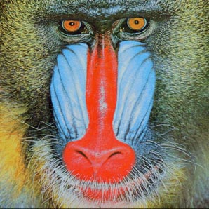

```{r, include = FALSE}
knitr::opts_chunk$set(
  warning = FALSE,
  collapse = TRUE,
  comment = "#>"
)
```

```{r setup}
library(OpenImageR)
library(rimager)
```


# Overview

[`rimager`](https://github.com/UBC-MDS/rimager) is a R package that provides a quick and easy way to perform image processing and graphic editing. The package includes four functionalities: reduce the size of the image, crop the image into a circle, reduce the image colors, and blur or sharpen the image. 


# Functions

## `circropper(input_path, margin)`

#### Description: 
Create a new image cropped by a circle mask and leave a margin

#### Arguments:

`input_path`: character the image file path <br>
`margin`: double the distance between circle boundary and the original image boundary

## `redusize(input_file, output_file, width, height)`

#### Description:
A new image with the modified width and height will be created

#### Arguments:

`input_file`: character, the file path for the input file <br>
`output_file`: character, the file path for the output file <br>
`width`: integer, the width of the reduced image <br>
`height`: integer, the height of the reduce image

## `imgfilter(input_path, filter_type, strength, output_path = NULL)`

#### Description: 
The filter types include 'blur' and 'sharpen'; where blur blends neighboring pixels and sharpen enhances edges. The strength of the filter indicates how much of effect is applied to the image; where 0 is no effect and 1 is very strong effect.

#### Arguments:

`input_path`: character the file path of the image <br>
`filter_type`: character filter to be applied to the input image. options: 'blur' and 'sharpen' <br>
`strength`: numeric or integer (0 to 1) the strength of the selected filter effect <br>
`output_path`: character or NULL (default NULL); the file path of the resultant image <br>

## `reducolor(style, input_path, output_path = NULL)` 

#### Description: 

Reduce the image color to either 2 or 8 colors for cartoonized effect.  

#### Arguments:

`style`: integer, either 0 or 1 0 for white and black colors, 1 for 8 colors  
`input_path`: character, the image file path  
`output_path`: character, if not Null, the modified image will be saved in the provided folder path and name  


# Examples

We will use `mandrill.jpg` saved in the `images` folder of this repository.




## `circropper`
```{r }
circropper("../images/mandrill.jpg", 0)
```

## `redusize`
```{r}
mandrill_redusize <- redusize("../images/mandrill.jpg", "../images/mandrill_redusize.jpg", 297, 200)
imageShow(mandrill_redusize)
```

## `imgfilter`
```{r}
mandrill_imgfilter <- imgfilter("../images/mandrill.jpg", "blur", 0.4)
imageShow(mandrill_imgfilter)
```

## `reducolor`
```{r }
#style 0, reduce the image color to white and black and save the new image mandrill_reducolor0.jpg in
#the images folder
mandrill_reducolor0 <- reducolor(0, "../images/mandrill.jpg", "../images/mandrill_reducolor0.jpg")
imageShow(mandrill_reducolor0)
```

```{r }
#style 1, reduce the image color to 8 colors. And because the output_path is NULL, the image will
#not be saved as a file.
mandrill_reducolor1 <- reducolor(1, input_path = "../images/mandrill.jpg", output_path = NULL)
imageShow(mandrill_reducolor1)
```
